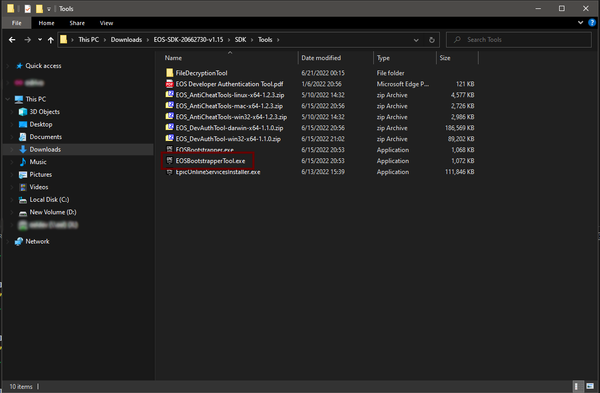
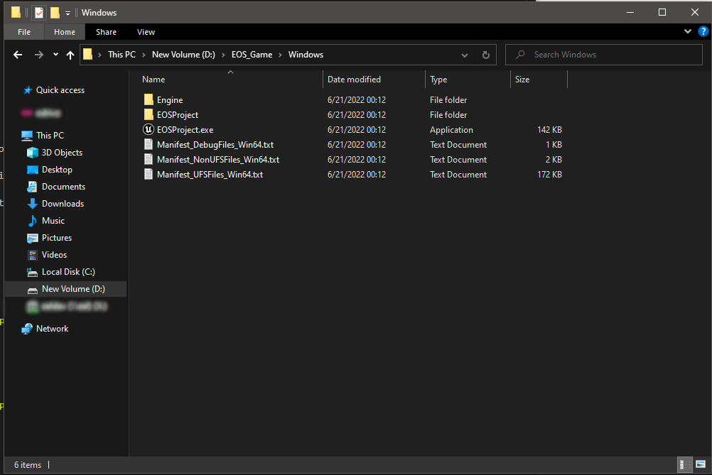
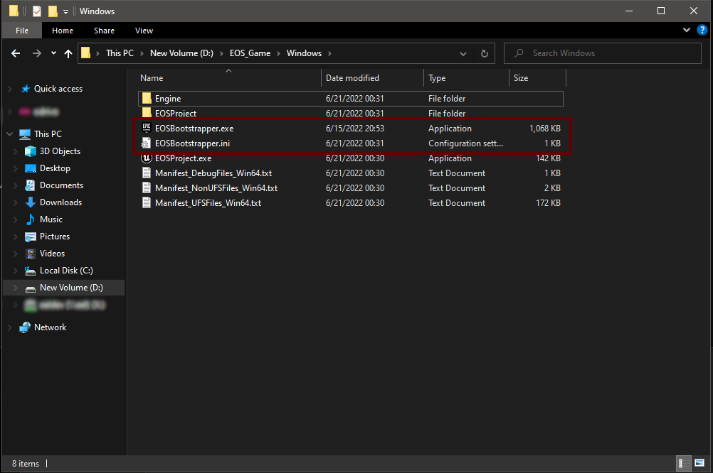
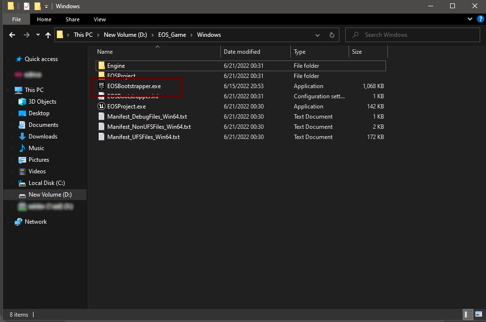
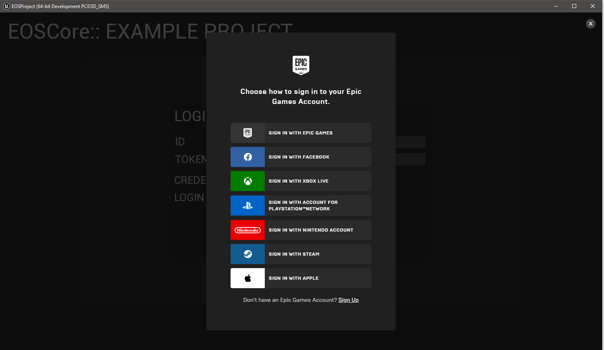

# Bootstrapping Game
- The EOS Bootstrapper is an executable that is used as a transient launcher application to run the actual game client executable. It is intended to be used as the target executable to run when users launch the game.
- [You can read more about this here](https://dev.epicgames.com/docs/services/en-US/EpicAccountServices/Crossplayacrossplatforms/RedistributableInstaller/index.html)

### Downloading the EOS SDK
- **[See this documentation on how/where to download the SDK](./bootstrap_game.md)**

### Locate the Bootstrapper
- The Bootstrapper comes with the EOS SDK, see the link above where to obtain the EOS SDK



 ## Bootstrapper Example
  - In this example we've packaged the EOSCore Example Project to D:\EOS_Game using Unreal Engine 5 and we're going to use the bootstrapper to bootstrap our packaged game so we can use Epic Online Services.



### Bootstrapper Command
- Running this command from a command prompt (cmd) will attempt to bootstrap the game executable
```cpp
C:\EOS-SDK-20662730-v1.15\SDK\Tools>EOSBootstrapperTool.exe -o D:\EOS_Game\Windows\EOSBootstrapper.exe -a ./EOSProject.exe
```

### Bootstrapper Output
- This is the output from the above command when bootstrapping the game
```cpp
Started Epic Online Services Bootstrapper Tool ++EOSSDK+Release-1.15-CL-20662730.

Creating config file: 'D:\EOS_Game\Windows\EOSBootstrapper.ini'.
Generated config:
ApplicationPath=./EOSProject.exe
WorkingDirectory=
WaitForExit=0
NoOperation=0

Successfully wrote config.
Completed successfully.
```

### Verifying bootstrap process
- If everything went well you should now have 2 additional files available



## Launching the game
- To launch the game you'll now use the **EOSBootstrapper.exe** file, this should hook your game into Epic Online Services on launch. You can also name the **EOSBootstrapper.exe** whatever you want in the bootstrapper command above to rename the file to match your project.



### The End Result


## Bootstrapper Help
```cpp
Epic Online Services Bootstrapper Tool ++EOSSDK+Release-1.15-CL-20662730. Configures the EOS Bootstrapper for use with an application.

This tool performs the following actions:
  1. Copies the local Boostrapper executable (EOSBootstrapper.exe) to the output file path (--output-path).
  2. (Optional) Updates the program icon and version info of the copied Bootstrapper executable, using the target application executable (--app-path).
  3. Creates a new config file next to the output Bootstrapper executable.

Usage:
  EOSBootstrapperTool.exe (-o|--output-path <path>)
                          (-a|--app-path <path>)
                          [-w|--working-dir <path>]
                          [-f|--wait-for-exit [<bool>]]
                          [-n|--no-operation [<bool>]]
                          [-r|--copy-resources [<bool>]]
  EOSBootstrapperTool.exe [-h|--help]

Options:
  (-o|--output-path <path>)      Output file path where to copy the Bootstrapper executable, as a relative or an absolute path, including the file name.
  (-a|--app-path <path>)         Target application file path to run, including relative path if the output Bootstrapper executable will not be located in the same folder.
  [-w|--working-dir <path>]      Optional. Relative working directory to set when running the target application.
  [-f|--wait-for-exit [<bool>]]  Optional, false by default. If set, Bootstrapper will exit only after the target application has exited.
  [-n|--no-operation [<bool>]]   Optional, false by default. If set, the target application will be started directly without initializing the EOS Service.
  [-r|--copy-resources [<bool>]] Optional, false by default. If set, the program icon and version information is copied into the output Boostrapper executable from the target application executable. This will also remove the existing Authenticode digital signature from the Bootstrapper executable.
  [-h|--help]                    Display this help message and exit.
  ```

 