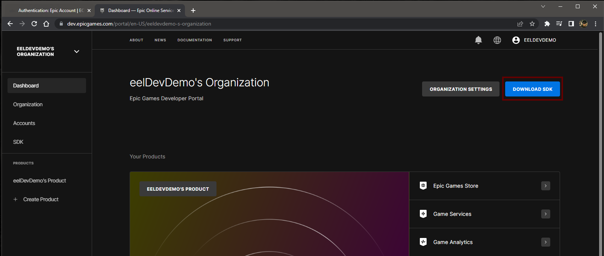
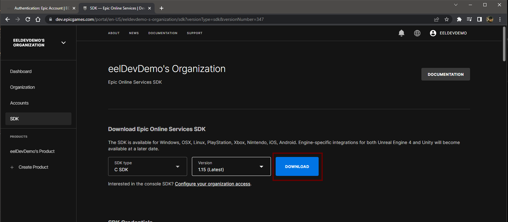
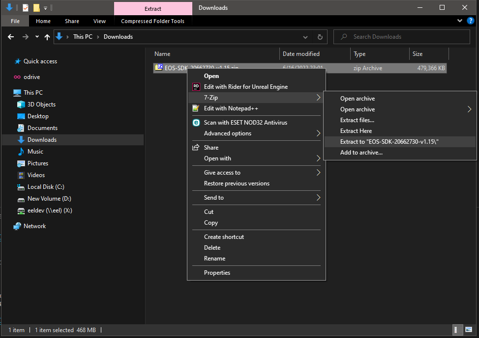

# Downloading EOS SDK
- The EOS SDK is included with the plugin but you may want to use some of the files that is included with the SDK.

## Downloading the EOS SDK
- Go to [https://dev.epicgames.com/portal/en-US/](https://dev.epicgames.com/portal/en-US/) to download the EOS SDK

