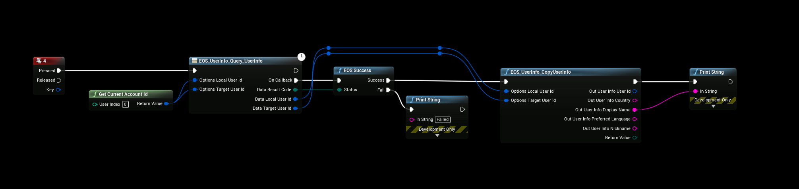
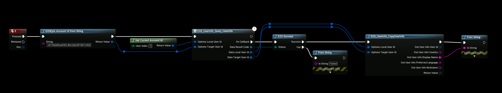

# Player Name / Display Name
Depending on your Authentication method there are different methods for getting your PlayerName or DisplayName, in this example we’re going to cover getting your PlayerName when using Epic Account authentication.

## Epic Account
Down below is an example for querying your own UserInfo and copying the data to finally get your DisplayName, you can then replicate this DisplayName for others to see in a multiplayer game for example.

## Your own Display name

## Other Display name
This example is Querying a friends Epic Account for their DisplayName, the example provides the targets Epic Account Id in a string form so you’ll need to adapt this to your own setup and how you get the other players Epic Account Id

