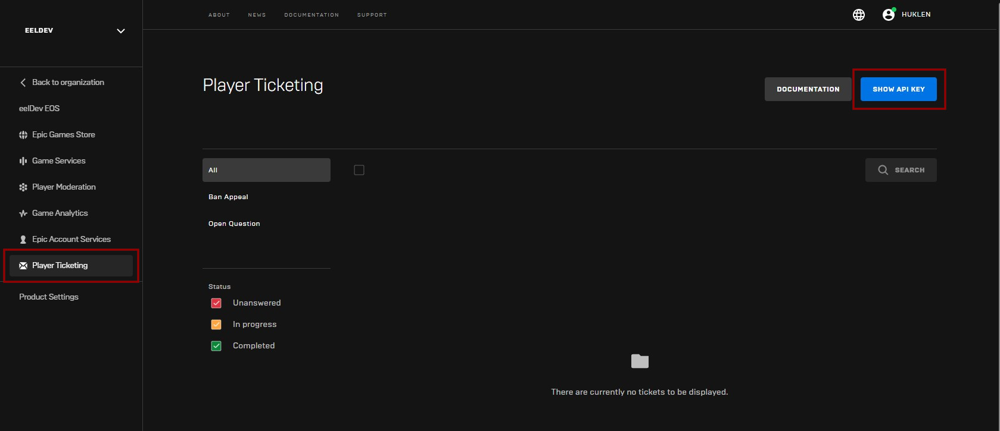
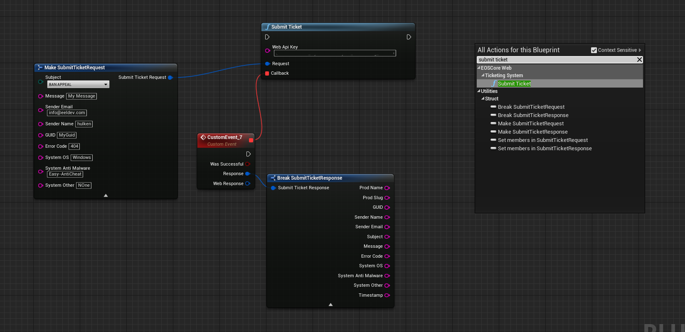
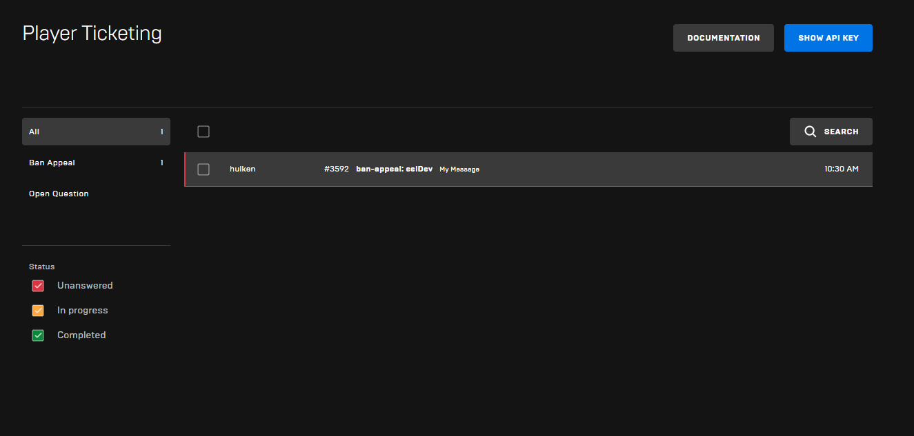
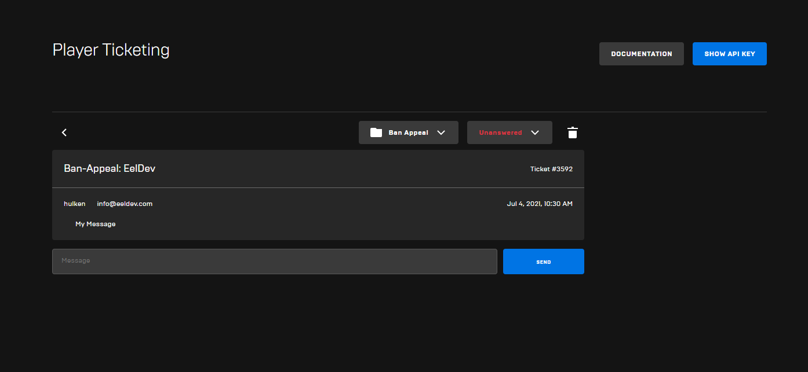

# Player Tickets
You can now use the PlayerTickets Web API with the new EOSCoreWeb module, this feature allows your players to submit In-Game tickets for ban-appeals, questions or whatever you want the player to be able to submit to you.

:::tip TIP
This Example has a Video Tutorial that you can find here: [Related Video](../videos/player-tickets.mdx)
:::

```
Epic Online Services (EOS) provides a Ticketing System to support your products from a centralized location using an automatically generated, preassigned email address and a public web API key. The ticketing system supports:

Tracking open, in-progress, and closed tickets
Merging related tickets
Replying to end-users who have submitted a ticket and receiving replies
```


## Web API Key
- Begin by getting your Web API Key from the Epic Developer Portal for your Product/Application, you can find this by going to “Player Ticketing” > “Show API Key” Button.



## Submitting a Ticket
The EOSCoreWeb module makes it easy to submit tickets, all you have to do is enter your Web API Key and fill out the information you need in the Request



## The Result


