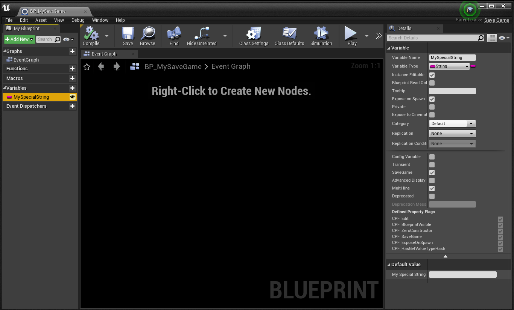
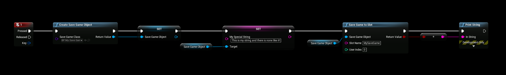

# Creating SaveGame
We’re going to use the default SaveGame system that comes with unreal with this example to keep it simple and available to all.

## BP_MySaveGame SaveGame class
- Begin by creating a **SaveGame Object** of type **SaveGame** class. The SaveGame class will have a custom string variable called **MySpecialString**, you can set the strings value to “This is my string and there is none like it!“ as this is just an arbitrary value for this example.

## Creating the SaveGame File
- We save our game to slotname **MySaveGame**, this is important to remember for the next steps in our tutorial.
- This will create a file called MySaveGame.sav located in **Project\Saved\Savegames\MySaveGame.sav**

