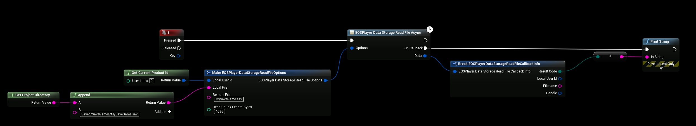
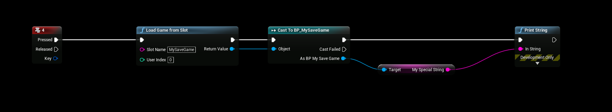

# Downloading SaveGame
In this step we’re going to Download the SaveGame file from the **EOS Remote Storage service** and load the data into our game. To test this properly, make sure that you delete the old **MySaveGame.sav** file before downloading it from EOS. Located in **\Project\Saved\Savegames\MySaveGame.sav.**

## Recap
- Created a SaveGame File with our Custom String
- Uploaded that SaveGame file to our Remote Cloud Storage

## Read File
- This will download the **MySaveGame.sav** savegame file to the **Local File** parameter.

:::danger NOTE
**Make sure to use absolute path to file**
:::

## Loading the Data
- To load the data from the **MySaveGame.sav** file that we just downloaded, you call **Load Game From Slot** using the same name from before **MySaveGame**. Cast to the correct **BP_MySaveGame** class so that we can get our custom string!

