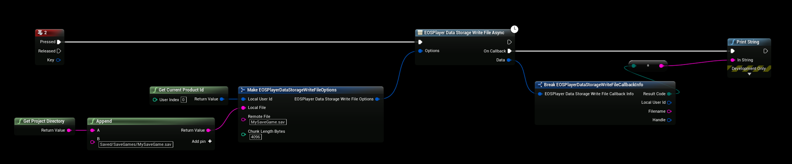

# Uploading SaveGame
In the previous step we created the **MySaveGame.sav** savegame file containing the custom string **MySpecialString**, it’s now time to upload that **MySaveGame.sav** file to EOS.

See the sample below what to set your parameters to

## WriteFile
- This will upload your **Project\Saved\Savegames\MySaveGame.sav** to your EOS Remote Storage: \**MySaveGame.sav**

