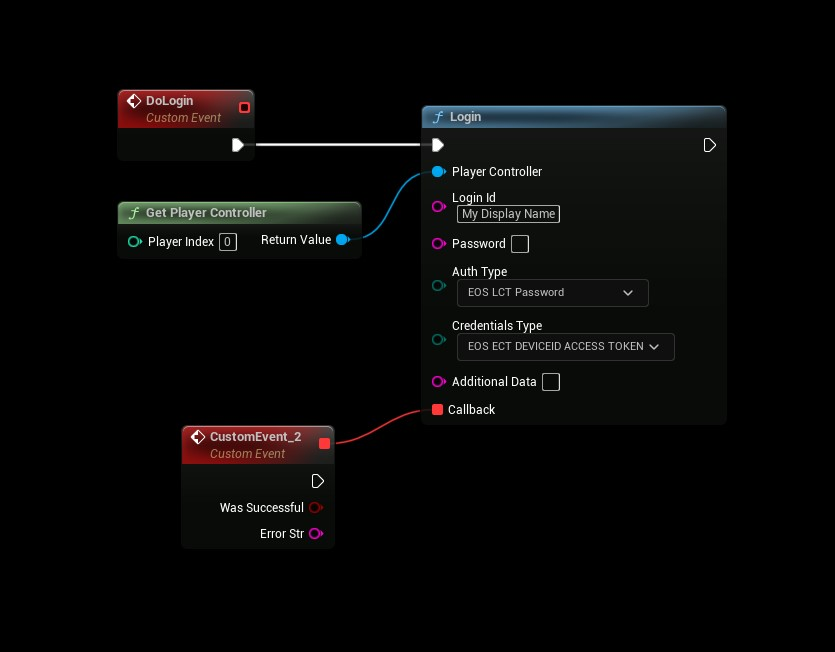

# Authentication: DeviceId
- **[Read more about this authentication method here](https://dev.epicgames.com/docs/services/en-US/GameServices/Connect/index.html#usingdeviceid)**

:::tip
This feature is relevant for Mobile personal devices and PC Desktop only. Device ID cannot be used with the Anti-Cheat Interfaces, which require an external account.
:::


## Device Id
- Use the following settings
```cpp
AuthType: Password
Credentials Type: DeviceId Access Token

Login Id: Your displayname
Password: <not used>
Additional Data: <not used>
```

