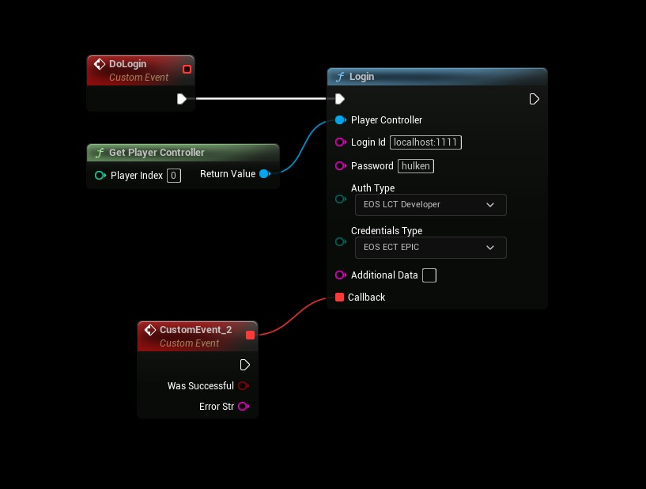

# Authentication: DevTool
- **[Read more about this authentication method here](https://dev.epicgames.com/docs/services/en-US/EpicAccountServices/DeveloperAuthenticationTool/index.html)**

## DevTool
- Use the following settings
```
AuthType: Developer
CredentialsType: Epic

Login Id: (host address) localhost:1111
Password: Token you specified in the DevTool, example: hulken

Additional Data: <not used>
```

