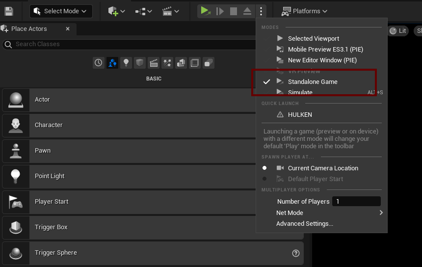
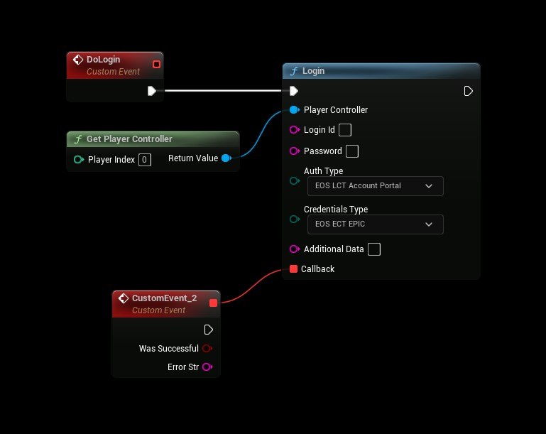

# Authentication: Epic Account
- **[Read more about this authentication method here](https://dev.epicgames.com/docs/services/en-US/EpicAccountServices/AuthInterface/index.html)**


## Logging in

### Standalone Game
- The SDK now uses the EOS Overlay to initiate authentication rather then opening the web browser, the overlay is only initialized in a Standalone Game when running in the editor.



### Blueprint Setup
- Use the following settings
```
AuthType: AccountPortal
CredentialsType: Epic

Login Id: <not used>
Password: <not used>
Additional Data: <not used>
```

