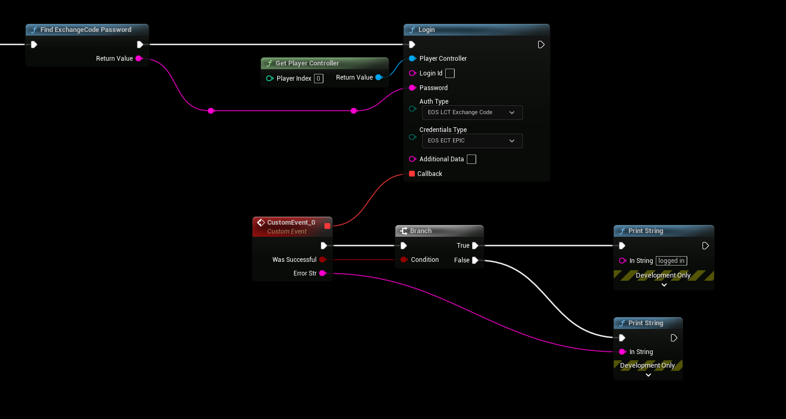

# Authentication: Epic Launcher

- **[Read more about this authentication method here](https://dev.epicgames.com/docs/epic-account-services/auth/auth-interface#epic-games-launcher)**

:::tip
This authentication method reuires EOSCore version 1.9.4.1 and above
:::

## Epic Launcher Authentication
- Use the following settings
```
AuthType: Exchange Code
CredentialsType: Epic

Login Id: not used
Password: Value from "Find ExchanceCode Password"
Additional Data: not used
```

