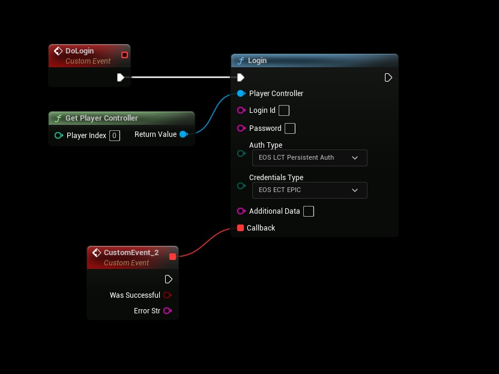

# Authentication: Persistent Auth
- **[Read more about this authentication method here](https://dev.epicgames.com/docs/services/en-US/EpicAccountServices/AuthInterface/index.html#persistinguserlogintoepicaccountoutsideepicgameslauncher)**

## Persistent Authentication (Use previous successful login)
- Use the following settings
```
AuthType: PersistentAuth
CredentialsType: Epic

Login Id: not used
Password: not used
Additional Data: not used
```

