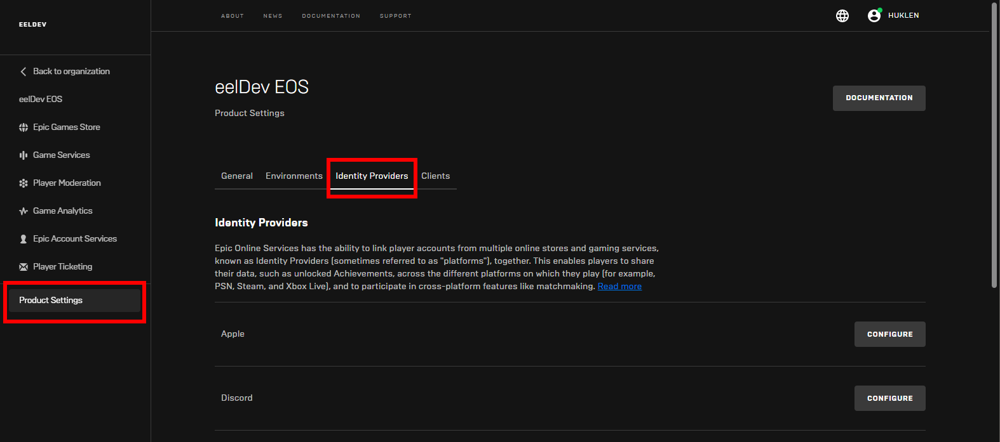
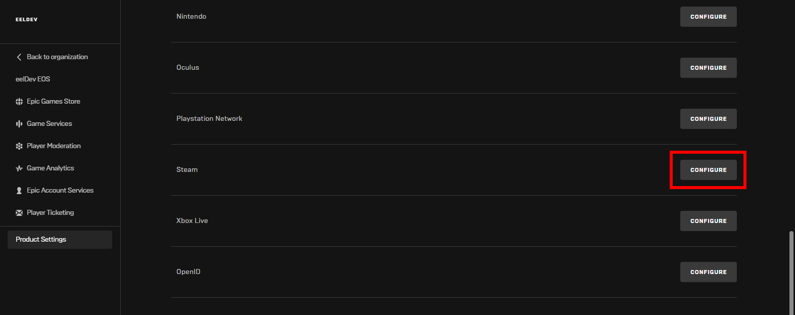
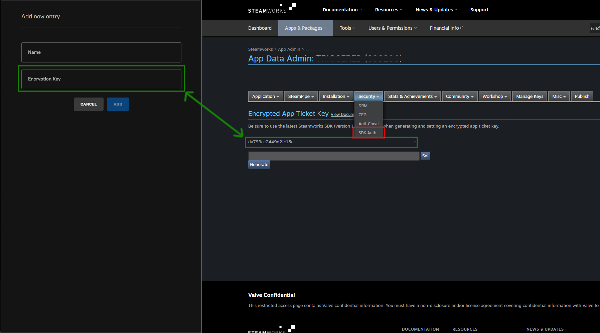
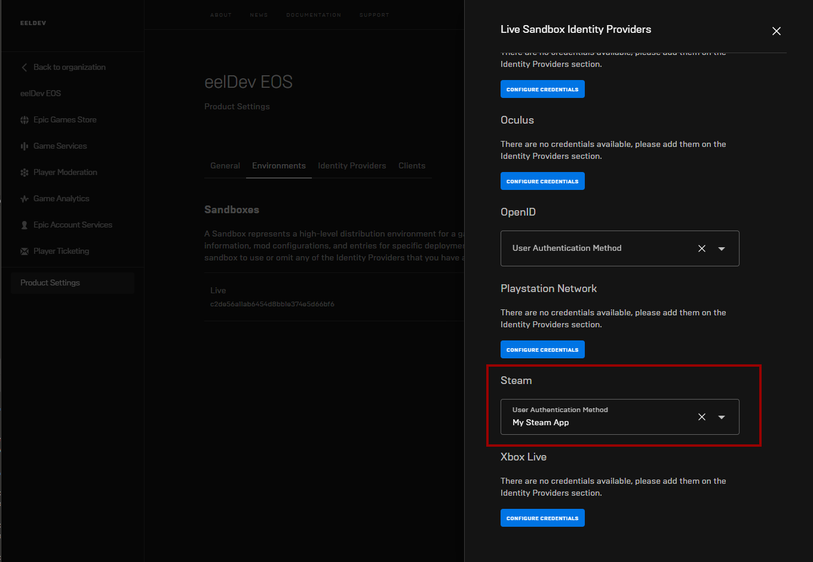
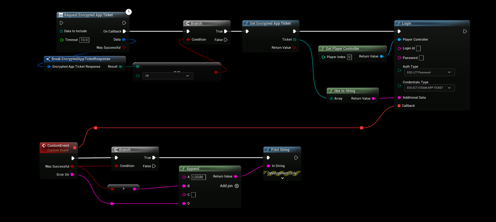
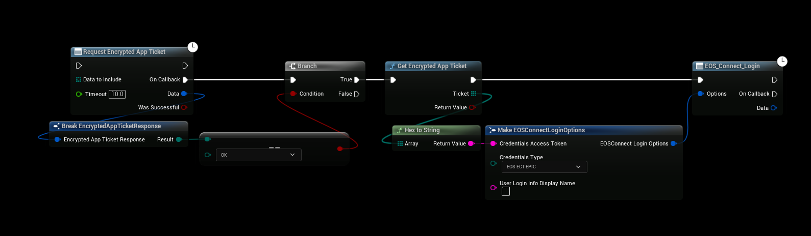
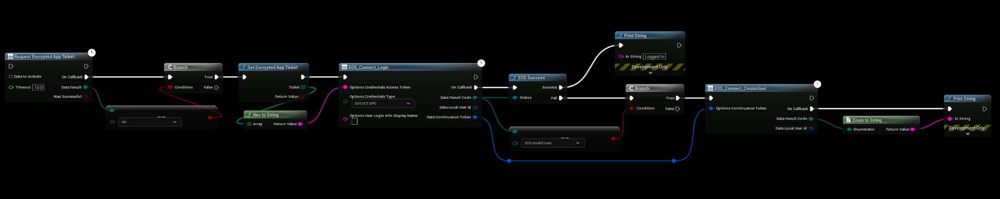

# Authentication: Steam

## Requirements
- Your own AppId on Steam
- Configure your Product to allow Steam as your Identity Provider in the EOS Dev Portal
- A method to acquire Steam Encrypted App Tickets

## Configuring your Project
- Login Epic Dev Portal





- Configure the Steam Identity Provider and add a New Entry, the Encryption key needed is found in the next secion of this tutorial

## Steam Appticket Key
- Login to your Steamworks account and select your Game/Application, under **Technical Tools** click on **Edit Steamworks Settings**.
- Inside your Applications Steamworks Settings, go to the **Security** tab and click on **SDK Auth**, here you will be able to generate the **Encryption Key** that you need for your EOS Product to Authenticate.
- **[Login to Steamworks](https://partner.steamgames.com/home)**




# Configuring the Identity Provider
- Next up we’ll configure our Product to allow Steam as an Identity Provider, go to your **Product Settings**, click on **Environments** and then click on **IDENTITY PROVIDERS**


- Select the Steam App that we created in our previous step **My Steam App**



## Logging in with Steam
- First we need to request a **Encrypted App Ticket** from Steam so that we can authenticate with EOS. In this example we're going to use the [SteamCore PRO Plugin](https://www.unrealengine.com/marketplace/slug/459e1c72939b4ead8b5132187808a3e7) plugin to retrieve a Encrypted App Ticket from Steam that we can use to authenticate.



- **[SteamCore PRO Plugin on the Unreal Marketplace](https://www.unrealengine.com/marketplace/slug/459e1c72939b4ead8b5132187808a3e7)**

- After Receiving a **Encrypted App Ticket** from Steam, we will attempt to login with the Ticket but if this is your first time connecting then you will get a failure with “Invalid User” as a result, all you need to do then is to call **Create User** (one time process), after the user has been created you should be able to login.

## Using SteamCore PRO and EOSCore together (DefaultEngine.ini)
- In addition to configuring SteamCore PRO plugin you'll need to set the NativePlatformService to SteamCore which allows the SteamCore plugin to initialize.
```cpp
[OnlineSubsystem]
DefaultPlatformService=EOSCore
NativePlatformService=SteamCore
```

## Steam Login (Async node)


## Creating a Steam User
- If you're not using the **Login** node you will have to also create the players steam user manually


