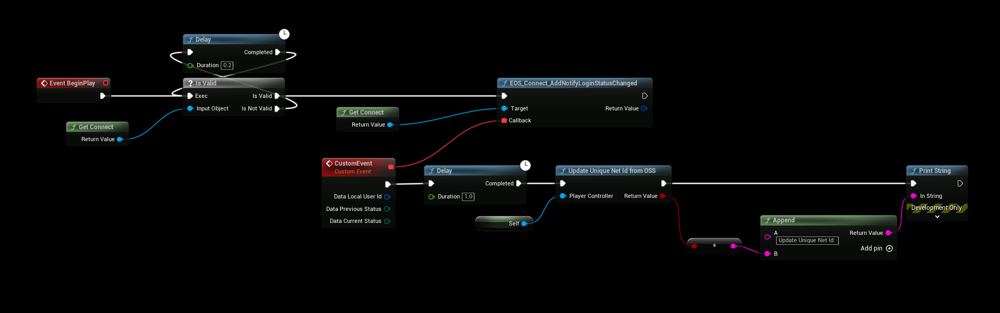

# Information

:::danger NOTE
The EOS SDK requires you to always login before calling **ANY EOS** functionality, the SDK is not going to log you in automatically.
:::

## Read Me
- There are essentially **two methods** for authenticating with the EOSCore plugin, one is via the **Login** node that handles a lot of logic in the background (such as creating new users, etc) and the other method is by using the Async nodes.

### Which Login Method should I use? Login Node or Async Nodes?
- Use the **Login node** if you can (see the liste of supported authentication methods to the left)

### Epic Account? DeviceId? What should I use?
- Use the **DeviceId** authentication method to begin with, it's simple and does not require any user registration or logging in and it supports most online features.

## Login Node
- The login node does not support all Authentication methods, the methods that are supported can be found in the list to the **left in the menu**. (DeviceId, etc.)

## Async Nodes
### Logging in with an Epic Account 
- [More Information about the Auth Interface](https://dev.epicgames.com/docs/epic-account-services/auth-interface)

### Logging in with a DeviceId Account
- [More Information about the Connect Interface](https://dev.epicgames.com/docs/game-services/eos-connect-interface)

:::warning IMPORTANT NOTE!
If you're using the **Async Nodes** to authenticate with EOS you'll have to update the games UniqueNetId manually to use the EOSCore Subsystem Features. 
:::

This example is added to the **PlayerController** Begin Play, this will listen for "**Login Status Changed**" from the EOS SDK and once the Login Status has Changed the **Callback** will execute and we can use that to update our Unique Net Id.

