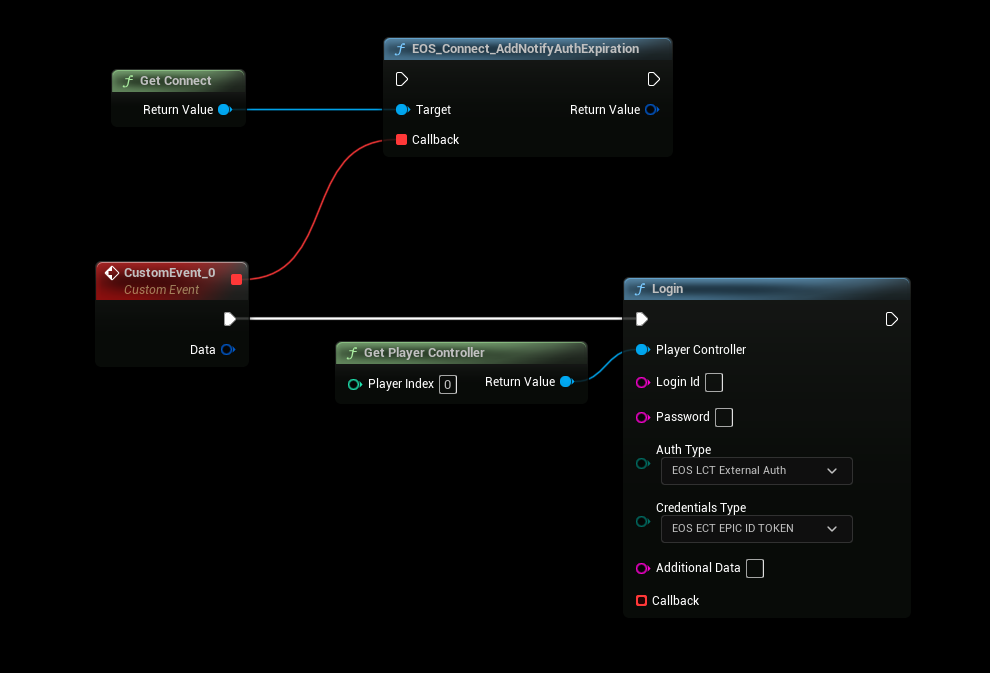

# Refreshing Tokens

## Refresh Login Tokens
Epic Online Services autentication has to be refreshed every XX minutes (depending on which authentication method was used) to keep the logged in session active.
- [You can read more about this here](https://dev.epicgames.com/docs/game-services/eos-connect-interface#user-authentication-refresh-notification)

## Login Node
- The login node handles automatic token refreshing when using an [Epic Account](./auth_epic.md) or a [DeviceId account](./auth_deviceid.md)

## Listening for Expiration
- You can listen/wait for auth expiration and the EOS SDK will notify you when it's time to refresh login tokens, see the sample below
- *Depending on your game you can add this to your Game Instance or any other persistent object (for example)*

