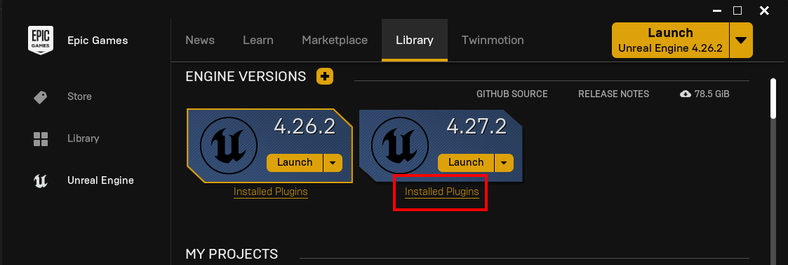

# Installing the Plugin 
You can install the plugin using the Epic Launcher

## Disable Engine EOS
- You have to **disable** the EOS plugins that comes with the engine as these will collide with the plugin.

## Installing
- Find the EOSCore plugin in your launcher and click **Install to Engine**

## Select Engine Version
- Select your Engine Version (4.27 in this case) then click on **Install** and the launcher will install the plugin for your selected Engine version

## Verifying Plugin Installation
- Verify that the plugin has been installed

