# Setting up Client & Policy Settings

:::tip NOTE
Beware, this client example will grant the client ALL PRIVILEGES, this might not be ideal in a Live project but it will be fine for testing/development purposes.
:::

Navigate to your Product Settings in the Developer Portal and click on the Clients Tab
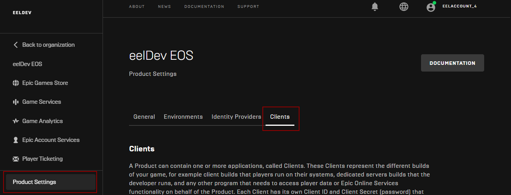

## Client Policy
Scroll down to the bottom of the page and click on “**ADD NEW CLIENT POLICY**“

### Adding a new Policy
1. Give your Policy a name
1. Select Custom policy type
1. Make sure “User required” is checked
1. Check all the Features as shown below

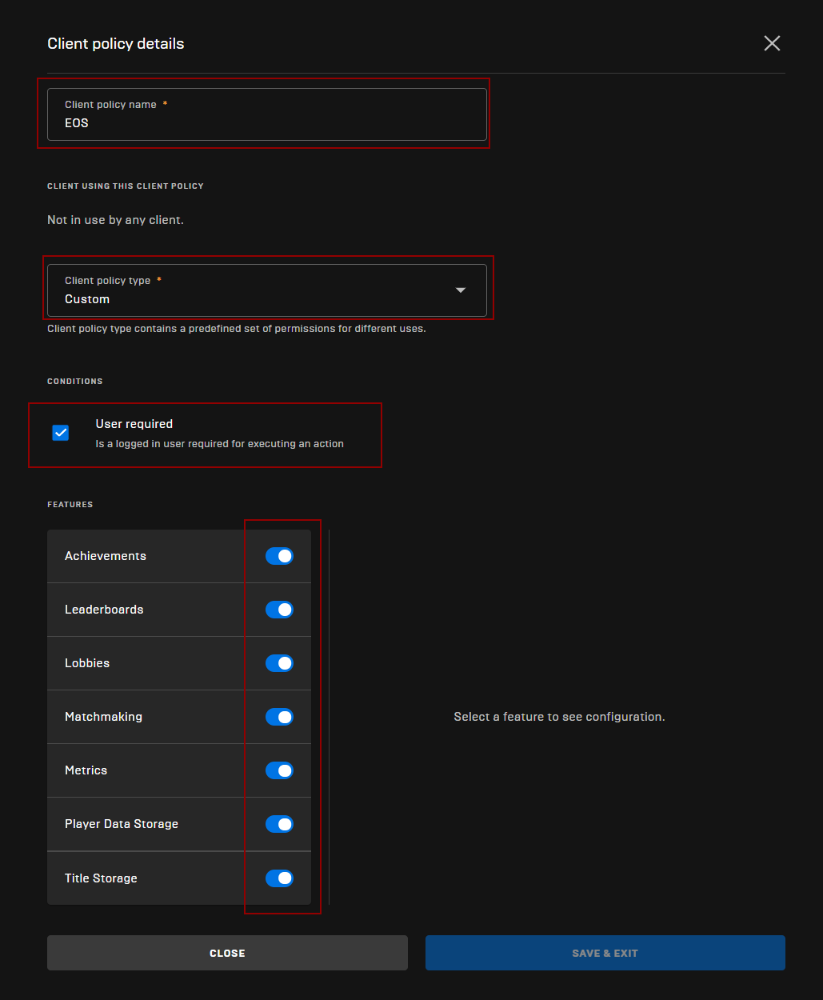

### Policy Permissions
- **CLICK ON EVERY FEATURE IN THE LIST (ACHIVEMENTS IN THIS EXAMPLE) AND MAKE SURE “ALL ACTIONS” ARE ALLOWED**

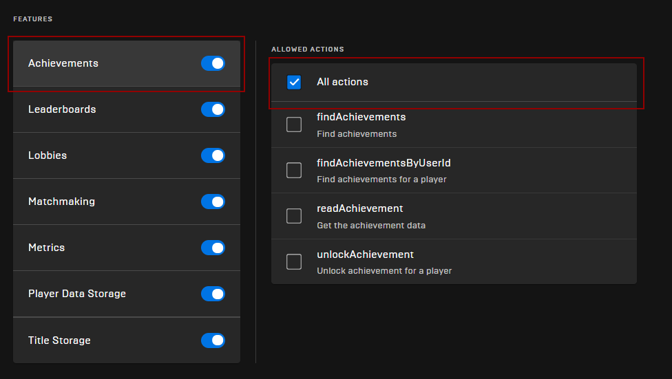

:::tip
Make sure you do this for all Features
:::

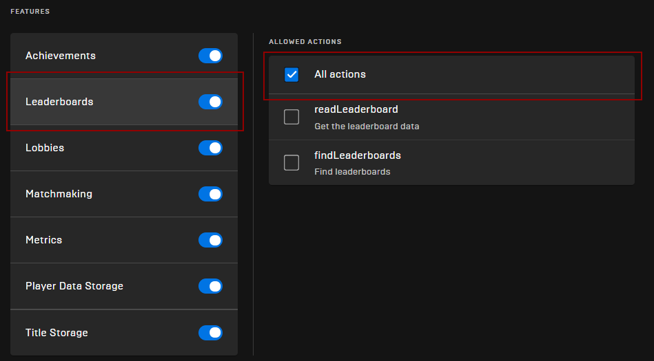

### Saving Policy Settings
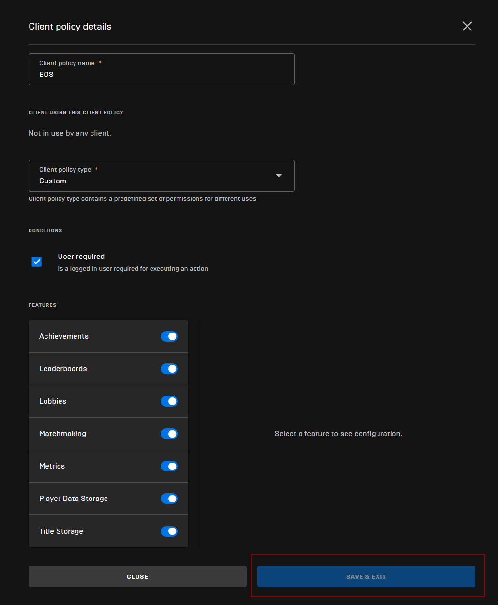

## Client

### Adding a new client
- In the Product Settings > Clients tab, click on “**ADD NEW CLIENT**“

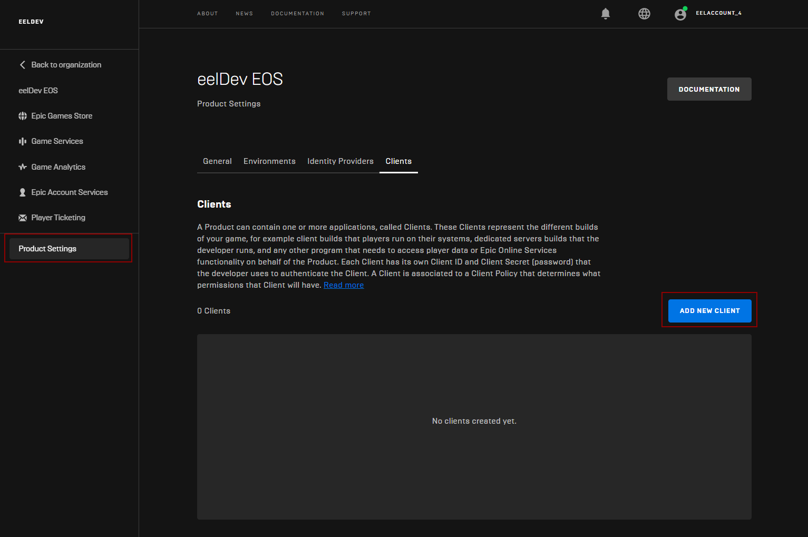

- Give your client a Name and select the Policy we just created in the previous step

### Saving the Client

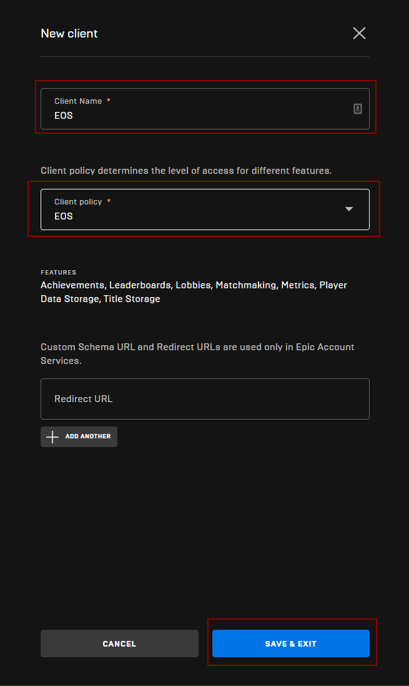

- After you’ve saved your client, confirm that it was added successfully as shown below:

### Confirming Client Creation
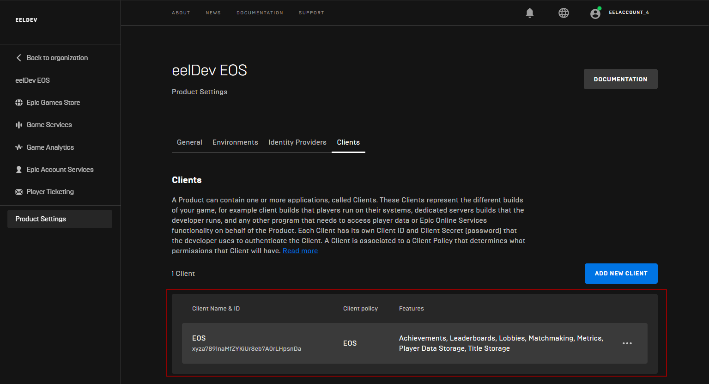

## Unreal Engine Configuration
- Your client is now ready to be used inside Unreal Engine!

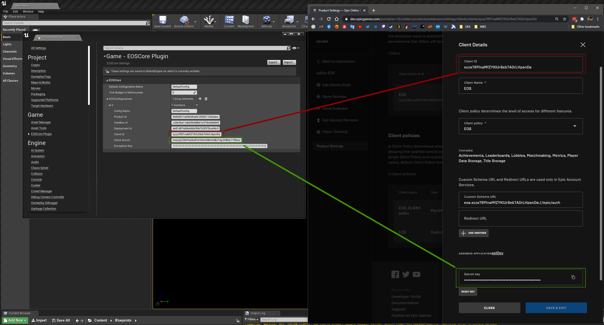

## Epic Account Services

:::tip
This step is optional but required if you want to use Epic Account Authentication.
:::

### Configuring
- Click on “Epic Account Servces“
- Click on “CONFIGURE” to configure your Application 
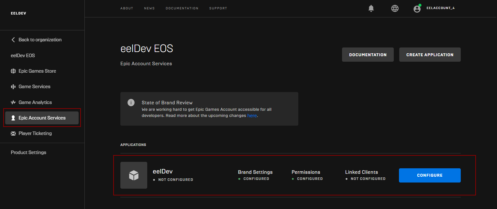

### Brand Settings
- Fill in the **“BRAND SETTINGS**” with your own settings that fits your project

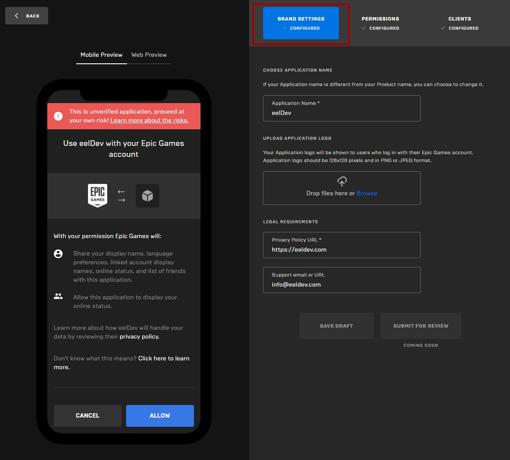

### Permissions
- Next click on the “**PERMISSIONS**” tab and allow all permissions (in this example), Basic Profile, Online Presence and Friends

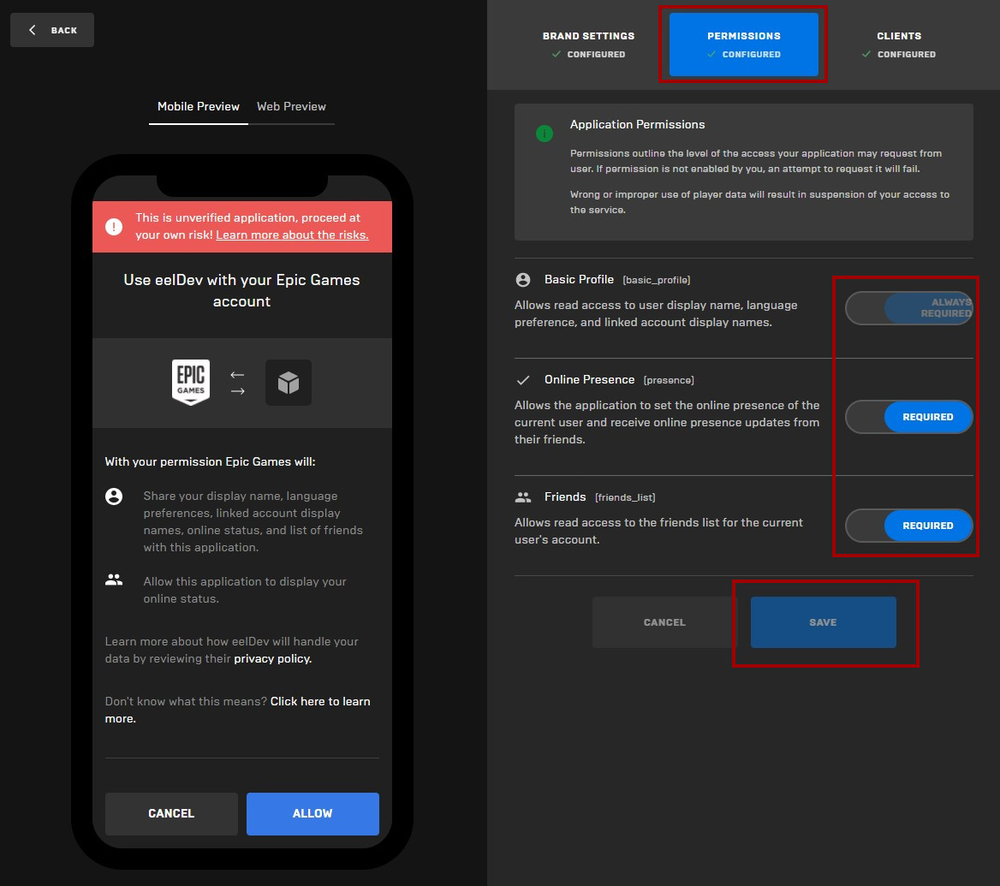

### Clients
- Nativate to the “**CLIENTS**” tab and select your EOS client that you just created in the previous step and click on “**SAVE**“

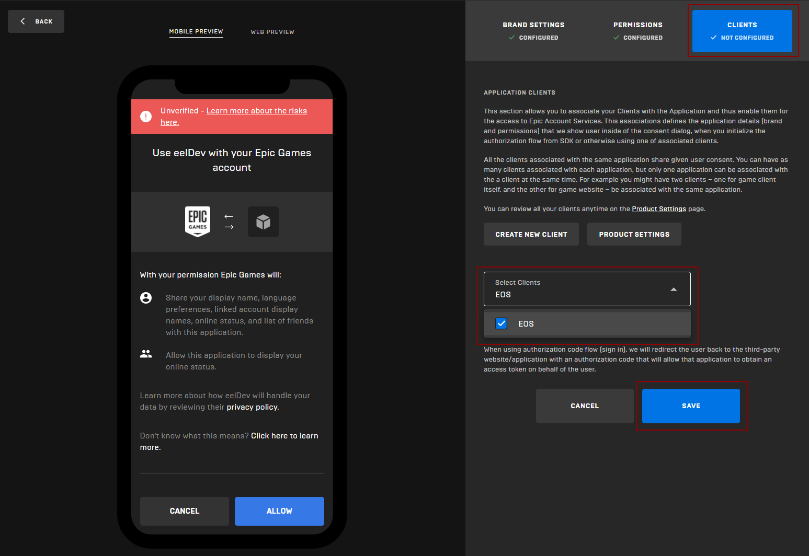

## Scope Consent
- EOSCore 1.9.3.3 and going forward allows you to customize the scope required when authenticating Epic Accounts, you'll have to make sure that the requested permissions match the client permissions in your developer portal.
- Project Settings configured Scopes are used by the "**[Login](https://eoscore.eeldev.com/docfiles/getting_started/auth/information/)**" node
- Make sure that the settings in Project Settings **match** the permissions in your Developer Portal

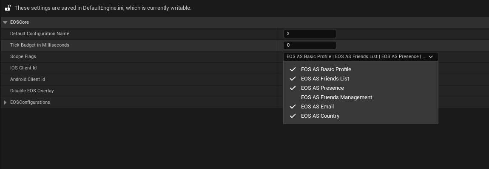

- Example scopes in the developer portal

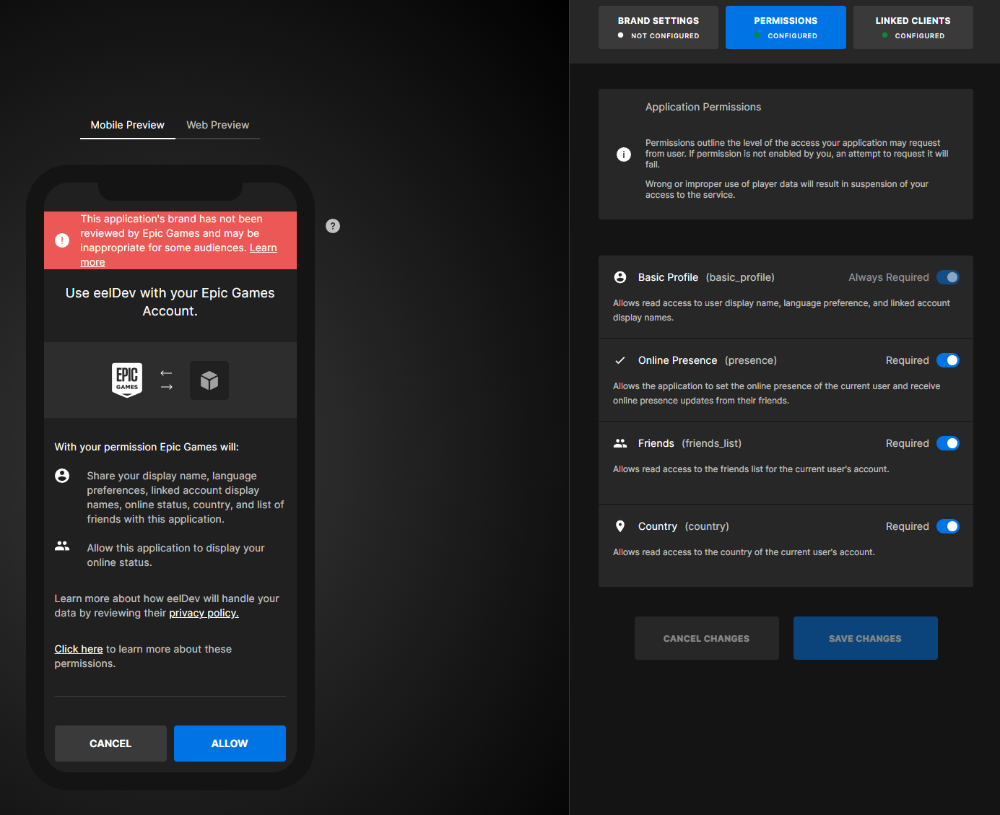

- If you are using the [async nodes](https://eoscore.eeldev.com/docfiles/getting_started/auth/information/) to authenticate you can specify the scopes directly in the node.

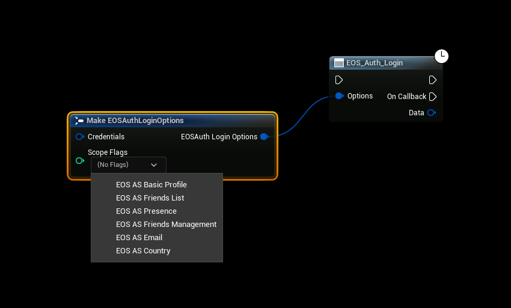