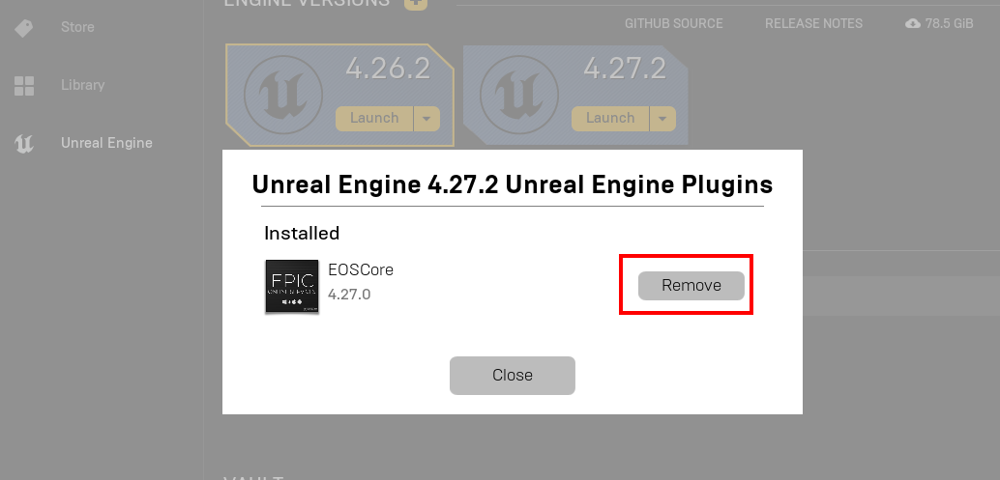

# Updating the Plugin
The Epic Launcher sometimes does not update plugins properly and in most cases it's best to do a clean install of the plugin instead of updating it

## Find the plugin installation
- Click on Installed Plugins for your Engine version


## Uninstall the Plugin
- Uninstall the plugin by clicking on the **Remove** button



## Delete plugin files (Optional)
- It's also recommended to double check and delete any left over files that the launcher did not remove, this can be done by manually deleting the EOSCore folder located here (replace 4.27 with your own engine version)

```
C:\Program Files\Epic Games\UE_4.27\Engine\Plugins\Marketplace\EOSCore
```

## Re-installing the Plugin
- All that is left now is to [install the plugin again](./installing_plugin.md)