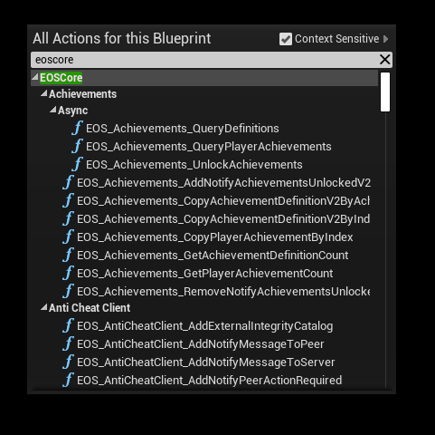
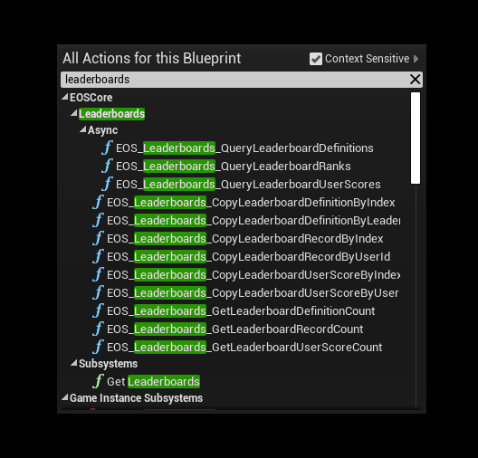
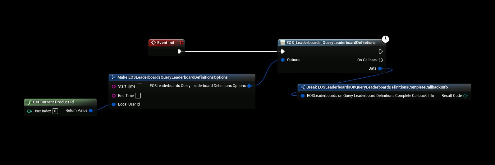
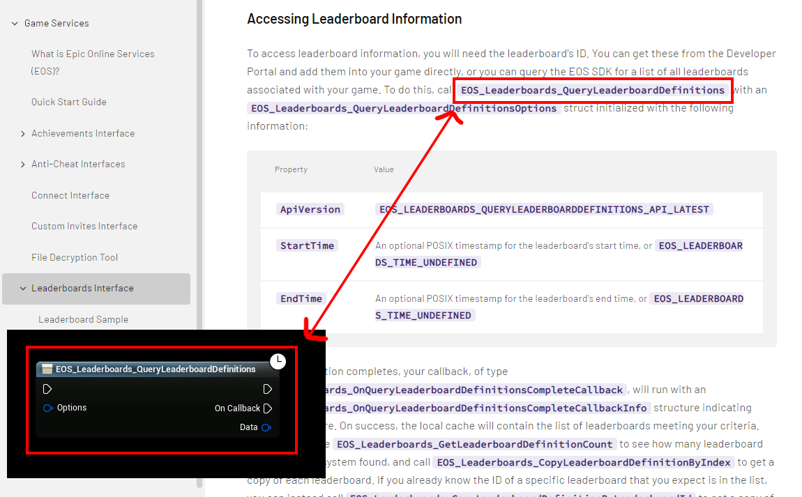

# Using the Plugin
After installing the plugin and enabling it for your project you can start using EOS functionality!

## Configuration
- Make sure you've configured the [Online Subsystem](./configuring_subsystem.md)
- Configure the plugin using your own [credentials](./setup_client_policy.md)

## Blueprint functions
- To find a list of all the available Blueprint functions, type in "eoscore" in the blueprint context menu

## Blueprint functions
- The plugin has a lot of Async functions that can be used to call EOS functions without hiccups, for example querying leaderboard definitions

## Using the Documentation
:::tip Documentation
It's recommended that you check out the Epic Online Services documentation when trying to figure out how to use the plugin
:::
- **[You can find the EOS documentation here](https://dev.epicgames.com/docs/services/en-US/index.html)**

For example, to find out how to setup and use leaderboards you can find the [Leaderbord documentation here](https://dev.epicgames.com/docs/services/en-US/GameServices/Leaderboards/index.html)

## Using the documentation
- All of the nodes in the plugin are named the same as in the official EOS documentation (this screenshot is taken from the EOS leaderboard documentation website) **[(found here)](https://dev.epicgames.com/docs/services/en-US/GameServices/Leaderboards/index.html)**

## Example Project
- The example project has examples for several EOS functions and might help you on your way in understanding how to use Epic Online Services, you can find the [**example project here**](../../example-project.md)