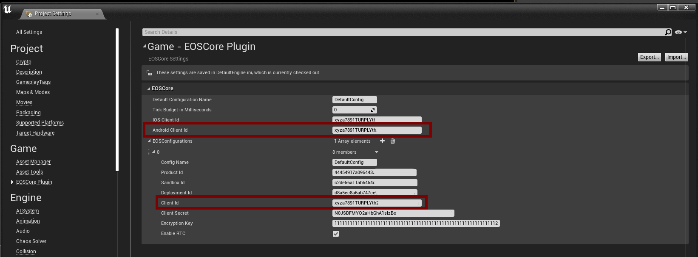

# Android Setup
- Using EOS on android requires an additional step, we need to set the Android Client Id in Project Setting.
- The Client Id we use for our android device can be the same used throughout our entire project, but Android devices requires this additional step becuase of login intent callback.

# Multiplayer
If you’re going to use multiplayer features on your Android Device, you also need to configure the **AndroidEngine.ini** configuration file, click on the link below to see an example on how to set this up.