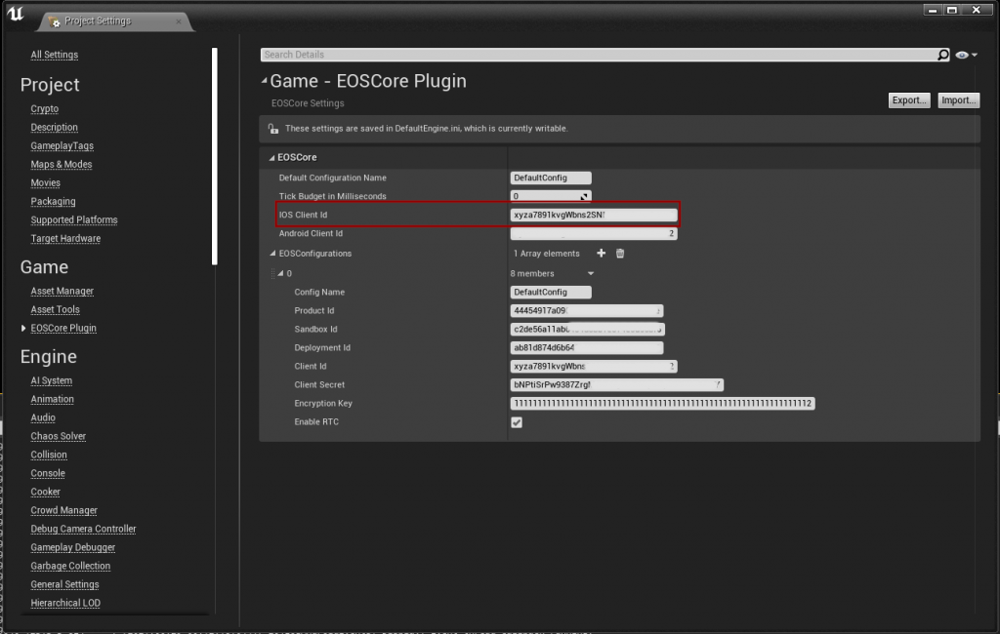

# IOS Setup
- You can now use **EOSCore** on your IOS devices! All you have to do is configure the IOS Client Id, this can be the same Client Id for all of your other clients but this has to be set manually as well, you can set it in the “Project Settings > EOSCore Plugin“. The plugin will handle the rest.

