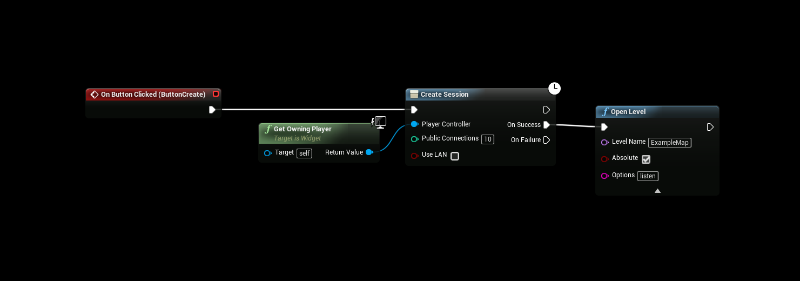
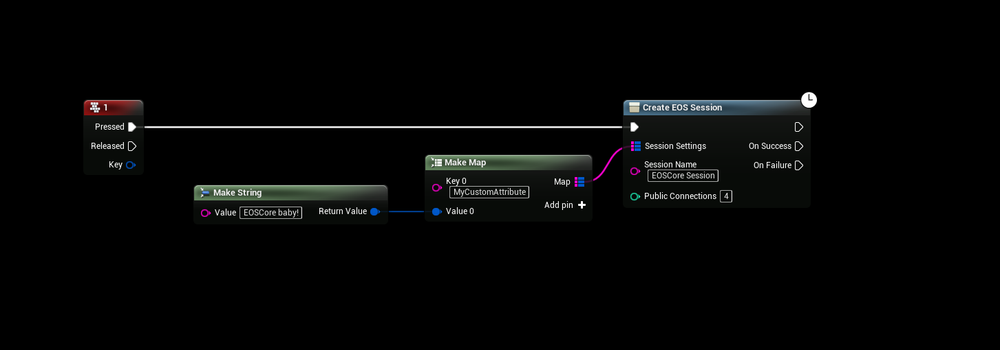

# Creating Multiplayer Session

:::tip TIP
This Example has a Video Tutorial that you can find here: [Related Video](../videos/multiplayer-sessions.mdx)
:::

## Default Node
You can use the default CreateSsession node in UE4 to create a simple multiplayer session

## Custom Node
The EOSCore plugin also has a custom “Create EOS Session” node that allows you to add Custom Attributes and set a Session Name for your multiplayer game

