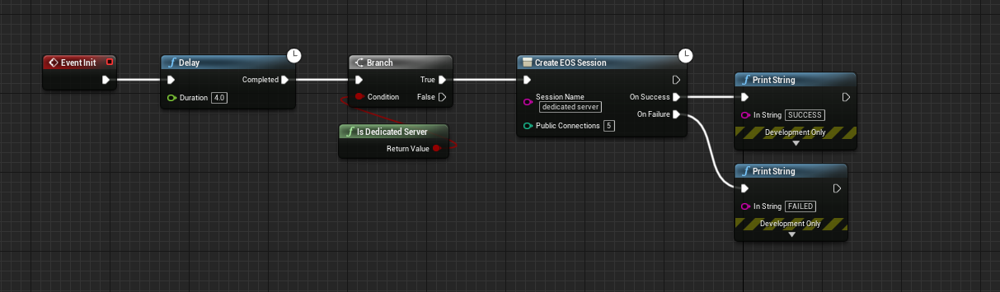
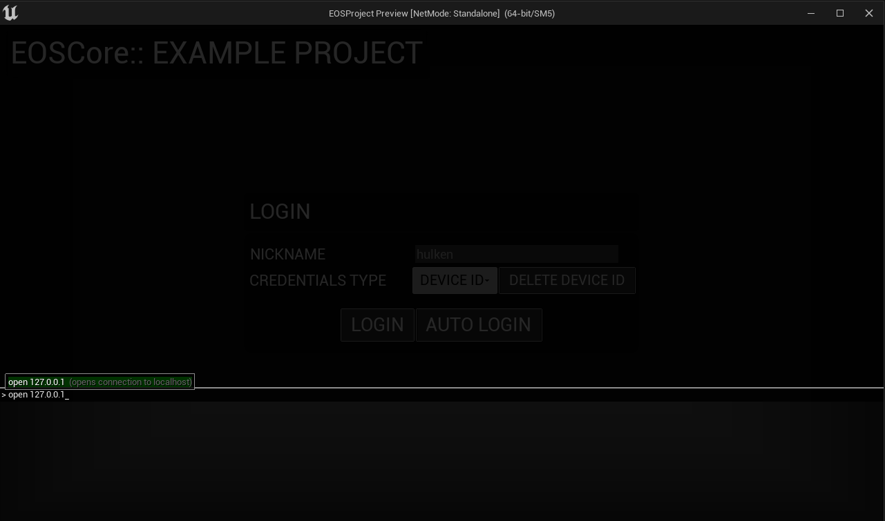

# Dedicated Server

:::tip TIP
This Example has a Video Tutorial that you can find here: [Related Video](../videos/dedicated-server.mdx)
:::

## Hosting the Server
You must host your dedicated game server on a remote machine/pc for everything to work correctly, firewalls and routers also has to be configured to allow ports 7777 for clients to connect successfully.

If you are hosting the server on the same PC you’re connecting from it will not work as expected because of how network routing works, please use a correct server setup as described above.

## Setting Up
Since Dedicated Servers don’t use **Relay Servers** we have to **disable** the **EOSCoreNetDriver**, simply removing the declarations will disable using the EOS NetDriver. 

## DefaultEngine.ini
Here is an example of what your DefaultEngine.ini should look like

```c
[Core.Log]
Online=Verbose
OnlineSession=Verbose
OnlineGame=Verbose
LogEOSCoreSubsystem=Verbose
LogEOSCore=Verbose

[OnlineSubsystem]
DefaultPlatformService=EOSCore

[/Script/Engine.GameEngine]
!NetDriverDefinitions=ClearArray
+NetDriverDefinitions=(DefName="GameNetDriver",DriverClassName="OnlineSubsystemUtils.IpNetDriver",DriverClassNameFallback="OnlineSubsystemUtils.IpNetDriver")

[/Script/OnlineSubsystemUtils.IpNetDriver]
MaxClientRate=1000000000 
MaxInternetClientRate=1000000000
InitialConnectTimeout=120.0
```

### Launching the Server
We’ll use Commandline arguments to authenticate and launch our server, the example below will authenticate our server using a local DeviceID, this is the minimum authentication required to communicate with Epic Online Services. The –EOSConfig= is optional, for example if you’re using a different configuration for your Server.

```
D:\WindowsServer\EOS_DedicatedServer.exe -server -log -AUTH_TYPE=deviceid -AUTH_LOGIN=test -AUTH_TOKEN=test -EOSConfig=ServerConfig
```

## Listing the Server
You can use the default Session nodes to list a Dedicated Server. We’ll use the GameInstance in this example.



This will List your dedicated server as a joinable session.

## Joining the Server
To join a dedicated server there are a few things you need to take into account:
- If you're hosting the server on your own **local network** you'll not be able to join the server via a server browser, this is because the server reports your **external IP address** to EOS and you can't join your own **local network** via your external ip address.
- If your server is hosted on your **local network** use the console to connect to it (see the sample below).
- Make sure that your client is [**logged in**](../getting_started/auth/information.md) before trying to connect to the server.

### Console Command
*Replace **127.0.0.1** with your servers IP address*
```cpp
open 127.0.0.1
```
