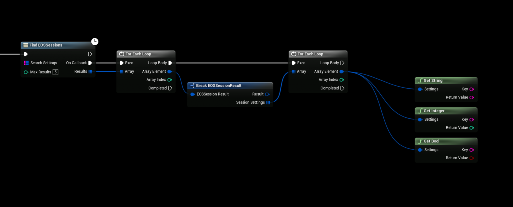
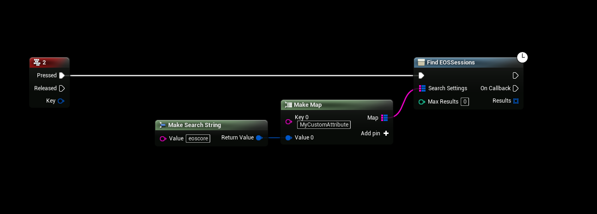
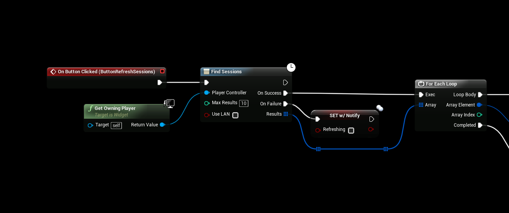

# Finding Multiplayer Sessions
The EOSCore plugin comes with a custom “Find EOS Sessions” node that allows you to find custom session attributes.

:::tip TIP
This Example has a Video Tutorial that you can find here: [Related Video](../videos/multiplayer-sessions.mdx)
:::

## Getting Session Attributes

## Filtering Session Results
You can also set a Filter value when searching for sessions, in this example you’ll only receive session results that contain the “eoscore” string.

## Find Sessions (Default node)
You can also use the default “Find Sessions” node that comes with UE4 to find EOS Sessions
