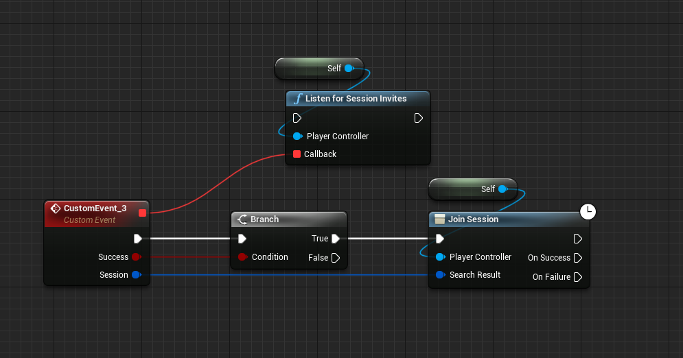

# Inviting your Friends

import ReactPlayer from 'react-player'

## Demonstration Video
<ReactPlayer url='https://youtu.be/K_AFmXRVRwE' />

## Bind the Event
First we need to bind the invite accepted event, we do this in our PlayerController (in this example), like this

 
The rest is handled by the plugin in the background, that is all you need to do to get Invites working!