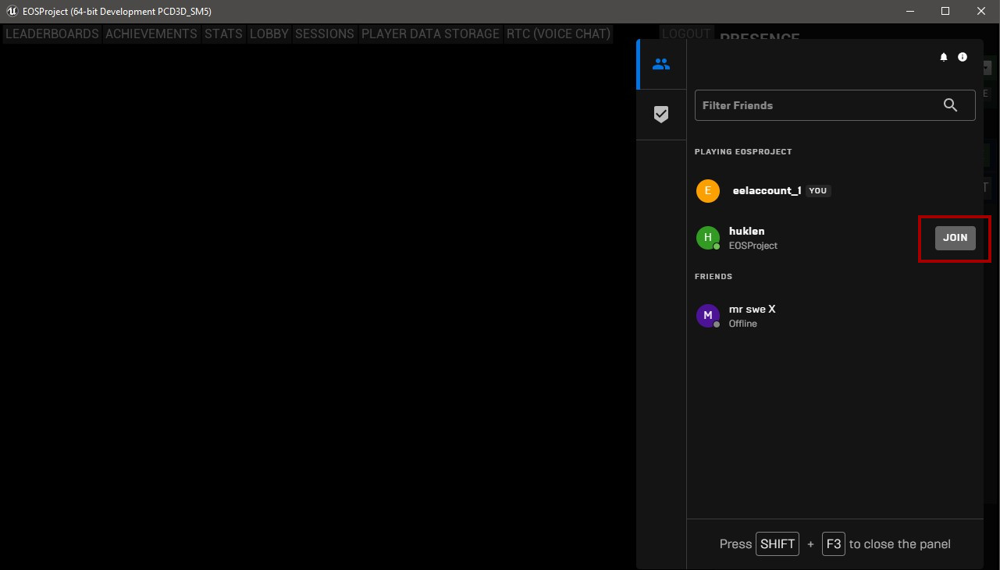
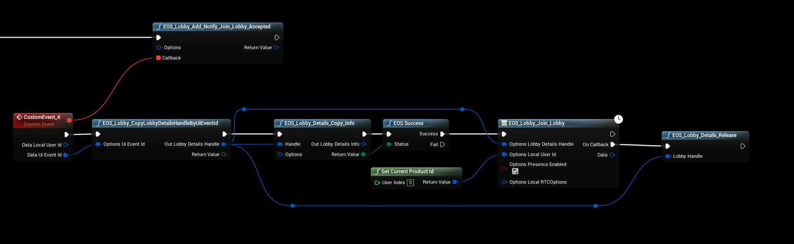

# Join Friends Lobby
- You can allow your friends to join your pre-game lobby

## Bind the Event
- To join a friends lobby from the Social Overlay all you have to do is to bind the event that is called when you click the “**JOIN**” button,
- In this example we're using using the PlayerController to bind this event but you can do it anywhere you want.

The Callback in the above screenshot will get executed when you press the “**JOIN**” button in the **Social Overlay** screen, after that we will get the lobby Handle needed to join the lobby our friend is currently in, then it’s simply a matter of joining the lobby and releasing the handle.
*That’s all you need!*