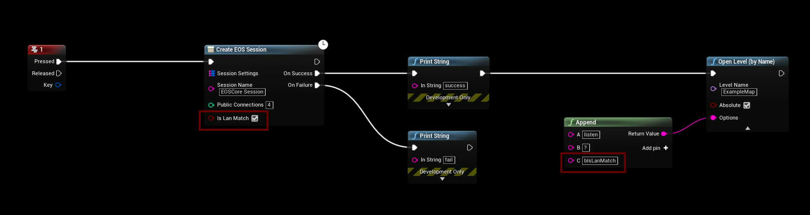
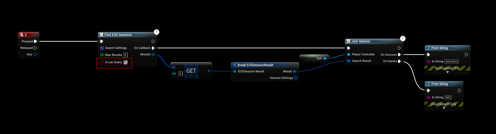

# LAN
- EOSCore **1.9.1.7** and onwards has limited LAN support, the EOS SDK does not have the ability to login to EOS accounts when offline so this functionality can not be used on non-internet connected LAN connections.
- To use LAN functionality you will first have to authenticate with EOS as usual, see the Authentication documentation.

## Creating LAN Session
- Make sure to check the “**Is lan Match**” checkbox when creating the session, another important step is to append **bIsLanMatch** when opening the game map, this will force the NetDriver to use an IP connection instead of the EOS connect string.

## Finding and Joining Session
- Check “**Is Lan Query**” checkbox to find LAN sessions, when the session is found you can call “join session” on the found result(s).

