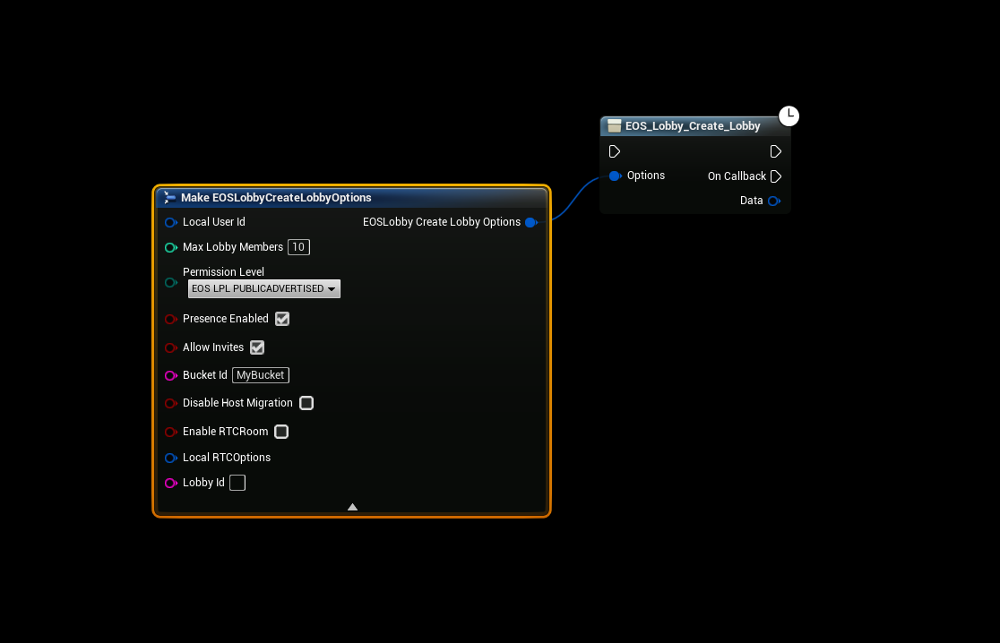
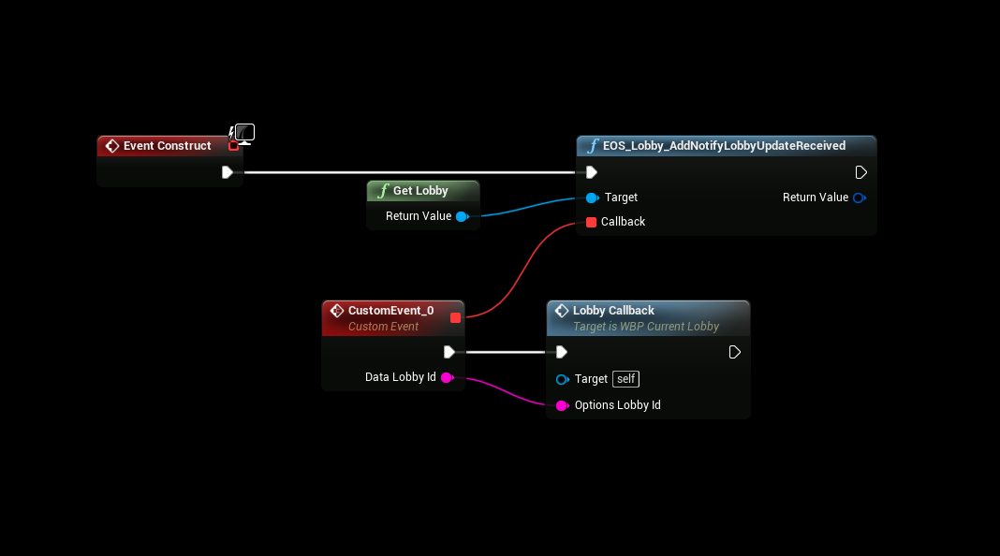
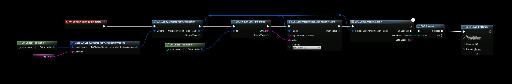
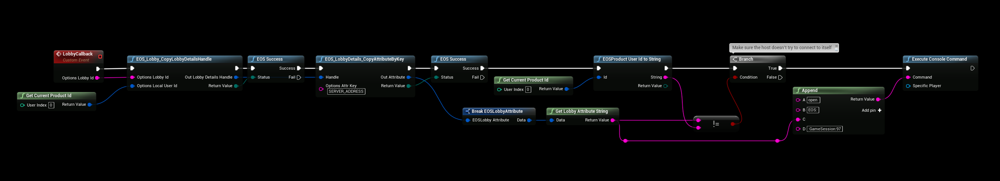

# Lobby to Session
In this example we’re going to take a look how to transition from a Lobby to a Game Session using only Blueprints and **EOSCore**

## Creating the Lobby
- Creating a EOS lobby is rather simple, all you have to do is call the “**Create Lobby**” function, for a complete lobby setup see the [EOSCore Example Project](../../example-project.md)




## Listening for Game Created
- We’re going to bind the “**Lobby Update Received**” delegate in the Lobby system so that we’ll get notified once the game server is available. The branch check in this example is to make sure that once the game is created the delegate will also be invoked on the host and we don’t want the host to try and connect to himself, since we’re using EOS Prudct Id to connect to the game session we can check if the LobbyOwner is the same as host for the game session.
- Then it’s simply a matter of invoking the console command “**open EOS:ProductId:GameSession:97**″ for the client(s) to connect to the host.



## Starting the Session
- In this example we’re going to be creating a simple game session by opening a level with the “listen” parameter, you could also use the “**Create EOSCore Session**” node to create your session but this is not covered in this example to keep it simple and understandable.
- Calling the function “**Update Lobby**” will invoke the delegate we bound earlier on all clients that are inside the lobby, in this case we’re using the **EOSCoreNetDriver** so we will use our ProductId as the SERVER_ADDRESS because clients will use our ProductId when connecting to us.
- Then it’s simply a matter of opening the level with the “listen” parameter, also note that you should not set the lobby game server before the map has actually finished loading on the host, but for simplicitys sake we’re setting the game server first and then loading the map in this example.



## Traveling to Game Session
- This event will be called once the host updates the lobby from the delegate we bound earlier, you may want to add some checks to make sure that the attribute was found and so on, but this is a mere example to get you started,

#### The final console command should look something like this: 

```
open EOS:ProductId:GameSession:97
```

