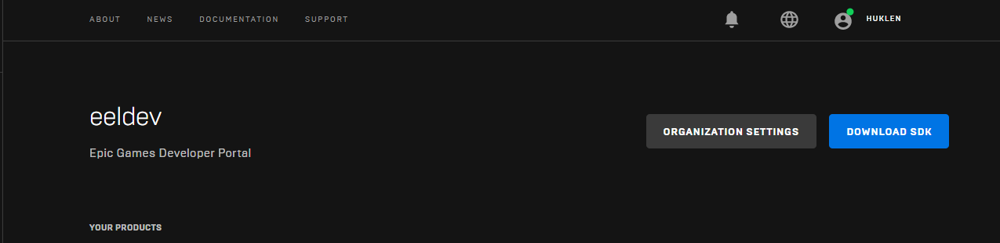
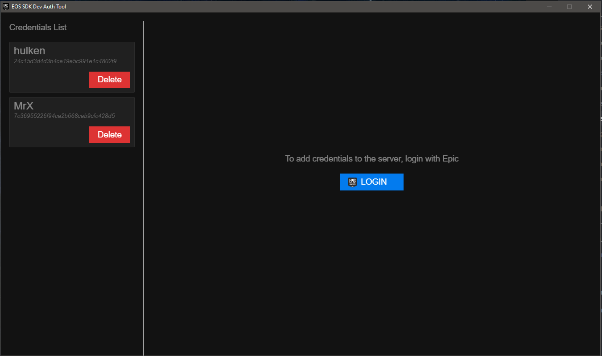
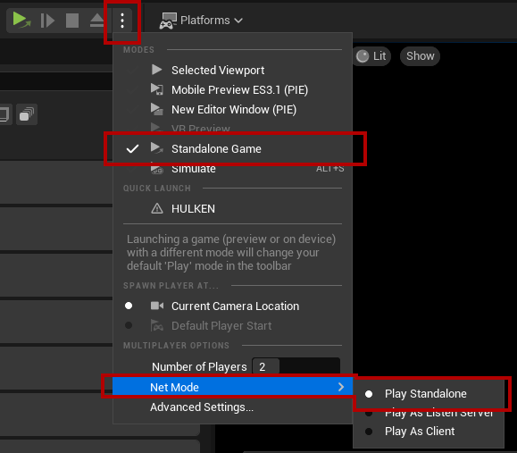
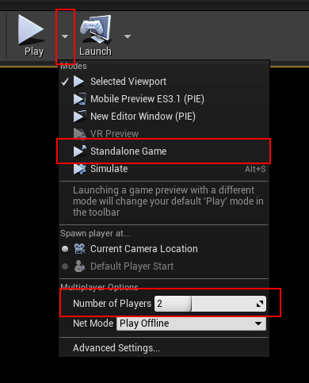

# Testing Multiplayer

:::tip TIP
This Example has a Video Tutorial that you can find here: [Related Video](../videos/multiplayer-sessions.mdx)
:::

## Requirements
- You must use 2 different accounts (for example 1 DeviceId and 1 Epic Account) when testing multiplayer
- DeviceId can’t be used when testing multiplayer on the same machine, you can however use 1 Epic Account and 1 DeviceId Account
- **It's recommended that you package your game project rather then using the editor.**
- If you're testing in the editor you must use a Standalone Instance (see below)

## Download DevTool
- The best way when testing multiplayer on the same machine is to use the DevTool that is provided by the EOS SDK. You can obtain the DevTool from the EOS Developer Portal, “Download SDK“

## Tokens
- After obtaining your copy of the DevTool, launch the application and create your token.

:::danger NOTE
Remember that for each multiplayer instance you must use a separate Epic Account, using the same Epic account for multiple instances will not work!
:::

## Testing in the Editor
- When testing in the editor you must use a Standalone Game instance, **however it's recommended that you use a packaged game client when testing multiplayer (and not use the editor)**

### Unreal Engine 5

### Unreal Engine 4
