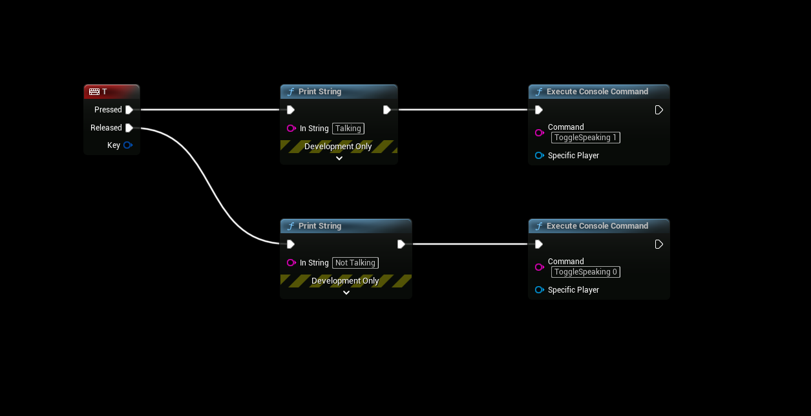

# Voice Chat (OSS)
- EOSCore **1.9.3.6** and onwards now supports in game voice chat using the Online Subsystem.

## DefaultEngine.ini
First edit your DefaultEngine.ini configuration file and make sure it has these values configured.

```cpp
[Voice]
bEnabled=true

[OnlineSubsystem]
DefaultPlatformService=EOSCore
bHasVoiceEnabled=true

[/Script/Engine.GameSession]
bRequiresPushToTalk=true
```

### Complete DefaultEngine.ini Example
Below is a configuration example that includes all EOSCore settings (including Voice Chat configuration)

```cpp
[Core.Log]
LogEOSCoreSubsystem=Verbose
LogEOSCore=Verbose
LogEOSCoreWeb=Verbose

[Voice]
bEnabled=true

[OnlineSubsystem]
DefaultPlatformService=EOSCore
bHasVoiceEnabled=true

[/Script/Engine.GameSession]
bRequiresPushToTalk=true
```

## Blueprint Setup
- This example is going to utilize the Character and PlayerController blueprints to setup and handle VOIP.


## PlayerController Blueprint
- The PlayerController is going to control the Push to Talk input.

