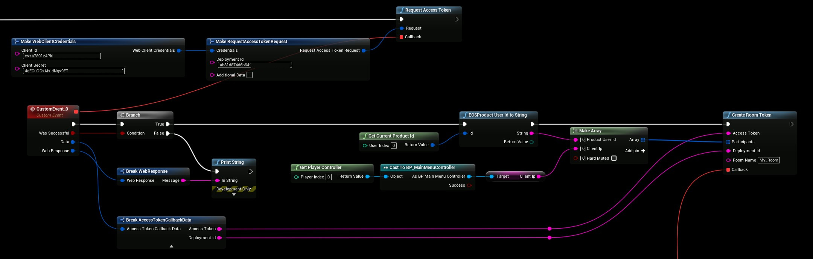

# Voice Chat (RTC/EOS Voice)
To use custom channels we need to use a TrustedServer to Create/Generate tokens for our clients to securely join the proper channels. This tutorial will show you all the steps required to get your Voice setup.

## Voice Server Credentials
- Let’s start by creating the **Voice Server** Policy, click on the “**Add new client policy**” button in your Product Settings

- Give your policy a name and select “**TrustedServer**” policy type

- The only permissions we need to give the server in this demonstration is the Voice Permissions, they should be pre-selected but if they are not then select them accordingly.

## Voice Client
- Next we’re going to create our Client, click on the “**Add new client**” button

- Give your client a Name and select the Policy we created in the previous step

- The finished result!

## Implementing Voice in the Game

### Client Ip (Optional)
- This step is *optional*, but it’s a good idea to get the **Clients Ip Address** so that EOS can choose the best server for the client to connect to, **GetPublicIp** is a utility function provided by EOSCore

- Use the **Credentials** that we created earlier for our VOICE_SERVER, these settings should be set like in the example below when calling “**RequestAccessToken**“
 

- We request our AccessToken from the **Epic Web API** and wait for a response, after we receive our **AccessToken** we can use the Token to generate a Room Token for our Client to use to join the channel

- The last step we finally get to join our room, see the example below:

## Conclusion
- Check your Output log and look for any errors if it’s not working

:::tip
See the Official documentation if you have questions regarding the Voice Service
:::